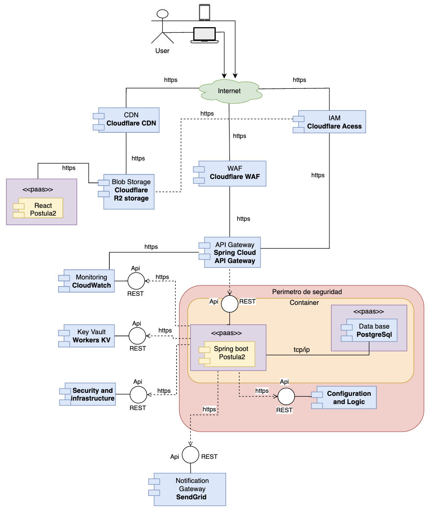
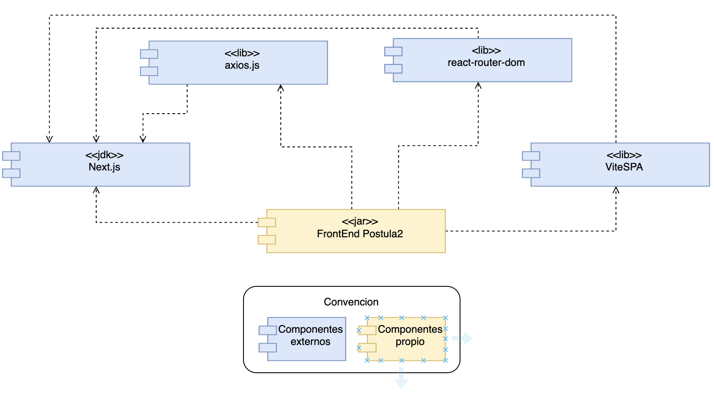
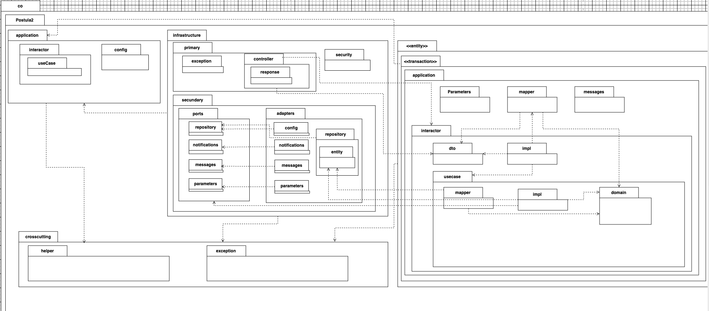
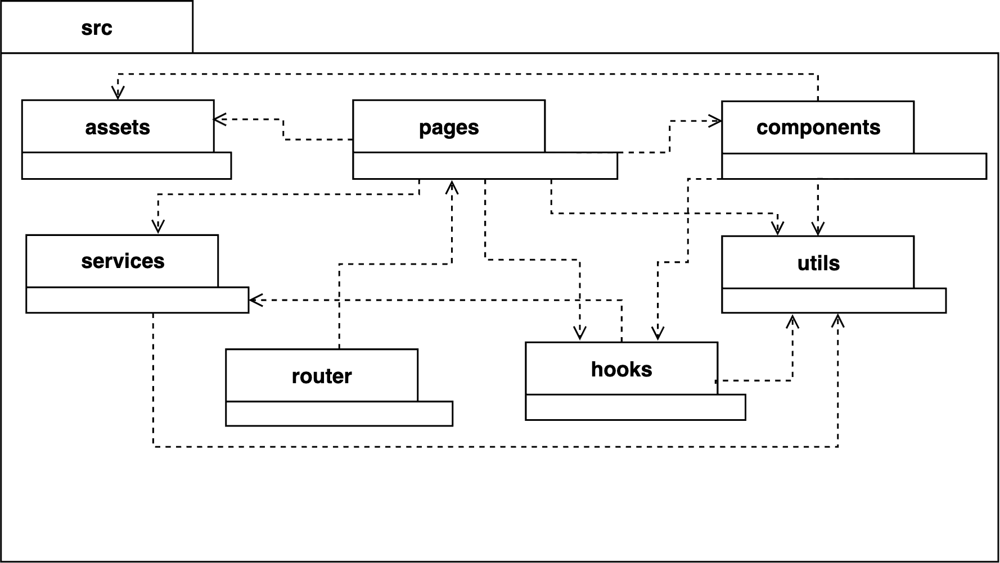
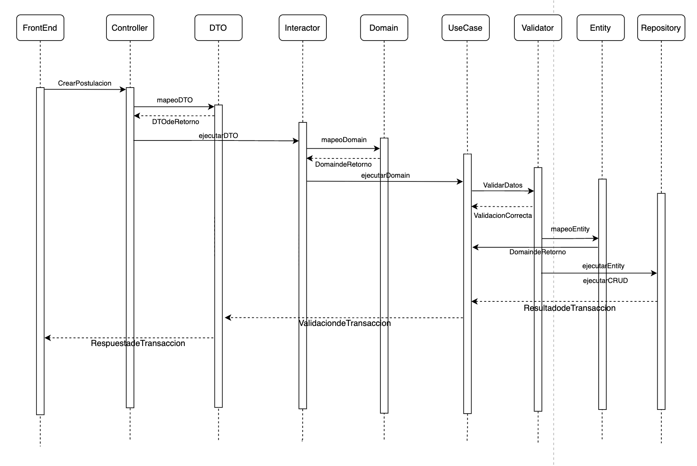
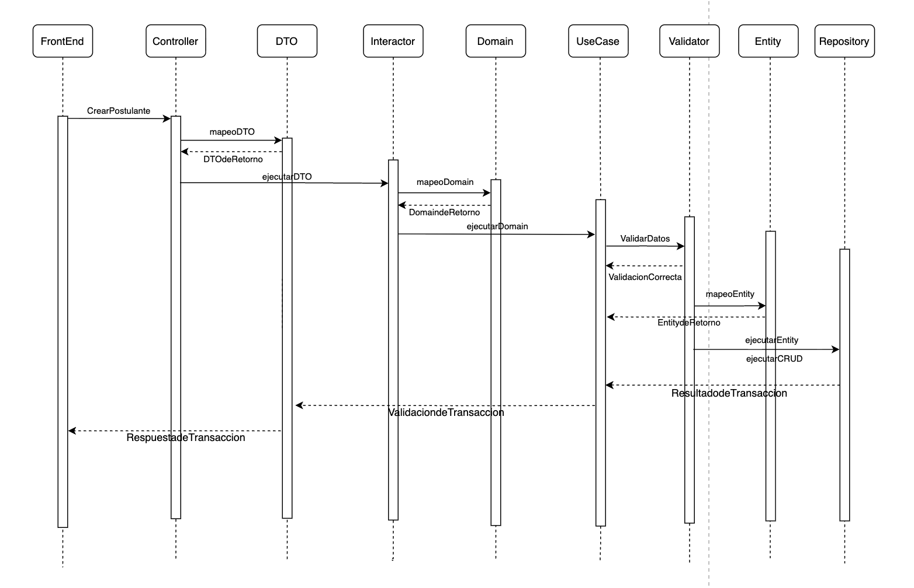

# Postula2

**Creado por:**
### Simón Tabares Arias

**Postula2** es un sistema web que permite la postulación a diferentes cargos u ofertas laborales, la gestión y publicación de dichas oportunidades. Los usuarios pueden registrarse, postularse y consultar ofertas disponibles, mientras que las empresas o administradores pueden crear, gestionar y validar los procesos de selección de manera centralizada y eficiente.
El sistema tiene un enfoque basado en una arquitectura modular la cual nos permite tener una baja cohesion y un alto acoplamiento. Priorizando temas como la **seguridad**, **escalabilidad** y **disponibilidad**

La documentacion describe tecnicamente lo siguente:

- **Despliegue:** Componentes adoptados y desarrollados, asi como su ubicación en la infraestructura.
- **Componentes:** Módulos lógicos del backend y frontend, y sus funciones.
- **Paquetes:** Organización interna bajo capas y dependencias controladas.
- **Secuencias:** Flujos de interacción de casos de uso típicos (UI ↔ API ↔ servicios).

## **1. Diagrama de Despliegue**

**Descripción**
El diagrama de despliegque representa la arquitectura física y lógica de Postula2, mostrando los servicios adoptados y desarrollados, así como su interacción dentro del entorno.  
La solución está diseñada bajo un enfoque **cloud-agnostic**, escalables y desplegados en servicios administrados, garantizando **alta disponibilidad** y **seguridad** 

### **1.1 Componentes del Despliegue**

### **1.2 Componentes Principales**

| Componente | Tipo de Componente | Descripción | Justificación | ¿Es Bloque de Construcción? | Tipo de Bloque |
|-----------|-------------------|-------------|--------------|-----------------------------|----------------|
| **CDN** | Componente Adoptado | Entrega contenido estático del Frontend con baja latencia. | Optimiza el rendimiento y disponibilidad. | Sí | Genérico |
| **Blob Storage** | Componente Adoptado | Almacena imágenes y archivos asociados al catálogo y pedidos. | Evita sobrecargar en el backend y facilita escalabilidad. | Sí | Genérico |
| **WAF** | Componente Adoptado | Filtra el trafico y bloquea tráfico malisioso como(SQLi, XSS, CSRF). | Protege los datos y la infraestructura de la aplicacion. | Sí | Genérico |
| **Identity Management** | Componente Adoptado | Gestor de autenticación y roles. | Asegura y valida el acceso. | Sí | Genérico |
| **API Gateway** | Componente Adoptado | Punto de acceso unificado al backend. | Facilita enrutamiento y políticas de seguridad. | Sí | Genérico |
| **Traceability and Monitoring Platform** | Componente Adoptado | Observabilidad y detección temprana de fallos. | Mantiene la estabilidad del servicio. | Sí | Genérico |
| **Database** | Componente Adoptado | Persistencia de datos. | Garantiza consistencia y disponibilidad. | Sí | Genérico |
| **Parameters Catalog** | Desarrollo Propio | Configuración moderada y clara del sistema. | Permite ajustes sin redeploy. | Sí | Soporte |
| **Messages Catalog** | Desarrollo Propio | Gestor de mensajes del sistema. | Mejora mantenibilidad y soporte en diferentes idiomas. | Sí | Soporte |
| **Key Vault** | Componente Adoptado | Almacenamiento seguro informacion critica. | Previene exposición en el codigo de credenciales. | Sí | Genérico |
| **Notification Gateway** | Componente Adoptado | Envío eficiente de notificaciones. | Evita construir un servicio de notificaciones propio. | Sí | Soporte |
| **Container Management** | Componente Adoptado | Despliegue y ejecución de contenedores. | Garantiza portabilidad y escalado. | Sí | Genérico |
| **Postula2 Back End** | Desarrollo Propio | Funcional del negocio. | Procesa operaciones criticas del sistema. | No | Core |
| **Postula2 Front End** | Desarrollo Propio | Interfaz de usuario final. | Permite el facil acceso y experiencia de usuario. | No | Core |

### **1.3 Bloques de Construcción Adoptados**

| Componente | ¿Es de Pago? | Fabricante | Producto | Versión | Protocolo | Justificación | Tipo de Bloque |
|-----------|--------------|------------|----------|---------|-----------|--------------|----------------|
| CDN | No | Cloudflare | Cloudflare CDN | Latest | HTTPS | Baja latencia y optimización automática. | Genérico |
| Blob Storage | Sí | Cloudflare | Cloudflare R2 Storage | Latest | HTTPS | Integrado y escalable con despliegue. | Genérico |
| WAF | No | Cloudflare | Cloudflare WAF | Latest | HTTPS | Protección perimetral, DDoS mitigation y firewall inteligente. | Genérico |
| Identity Management | Sí | Cloudflare | Cloudflare Access | Latest | HTTPS | Seguridad y manejo de roles centralizado. | Genérico |
| API Gateway | Sí | AWS | AWS API Gateway | V2 | HTTPS | Facilita la creación, gestión y protección de APIs,a cualquier escala. | Genérico |
| Traceability and Monitoring Platform | Sí | AWS | Cloudwatch | Latest | HTTPS | Trazabilidad y deteccion de errores en tiempo real. | Genérico |
| Database | No | PostgreSQL | PostgreSQL | 16+ | TCP/IP | Base de datos confiable y libre de licencias. | Genérico |
| Key Vault | Sí | Cloudflare | Workers KV | Latest | HTTPS | Protección de datos con auditoría y control de acceso. | Genérico |
| Notification Gateway | No | Google | Firebase cloud messaging| Latest | HTTPS | Comunicación confiable. | Soporte |
| Container Management | No | Render | Render Cloud | Latest | HTTPS | Despliegue optimizado. | Genérico |

### **1.4 Bloques de Construcción Desarrollados**

| Componente | ¿Pago? | Tipo | Fabricante | Producto | Versión | Descripción | Justificación |
|-----------|--------|------|------------|----------|---------|-------------|---------------|
| Back End Postula2 | No | Lenguaje | OpenJDK | Java | 21 | Lenguaje base de la solución. | Versión LTS estable y optimizada. |
| Back End Postula2 | No | Framework | Spring | Spring Boot | 4.3 | Framework modular y escalable. | Permite una arquitectura mantenible y modular. |
| IDE Backend | Sí | Entorno de Desarrollo | JetBrains | IntelliJ IDEA | 2024.3.3 | IDE para desarrollo profesional Java. | Aumenta productividad y calidad de código. |
| Asistente inteligente de Desarrollo | Sí | IA | Microsoft | GitHub Copilot | Latest | Desarrollo asistido. | Optimiza tiempos y detecta errores. |
| Base de Datos Serverless | No | DB Cloud | AWS | Amazon Aurora Serverless | Latest | PostgreSQL serverless con escalado automático. | Optimiza costos y ajusta recursos |
| Front End Postula2 | No | Framework | Google | React | 19 | Framework UI moderno basado en Javascrpit. | Soporta modularidad y escalabilidad UI. |
| IDE Frontend | No | IDE | Microsoft | Visual Studio Code | Latest | Editor robusto, extensible y estándar para web. | Ligero y versátil para desarrollo frontend. |
| CI(Integracion continua)/CD(Continuo despliegue) | No | Calidad | SonarQube | SonarQube | Latest | Inspección continua de seguridad y estilo. | Garantiza calidad en todo el ciclo. |

### **1.5 El diagrama de despliegue de  es el siguiente:**

# **2. Diagrama de Componentes**

## **Descripción**
El diagrama de componentes representa la estructura de Postula2, identificando los módulos que componen y permiten la solución en el **Backend** y **Frontend**, así como sus dependencias.  
Cada componente encapsula una responsabilidad específica, facilitando la mantenibilida y escalabilidad del sistema.

---

## **2.1 Componentes del BackEnd**

| Componente | Descripción | Motivación / Justificación | Depende / Usa | Tipo de Componente |
|-----------|-------------|----------------------------|---------------|-------------------|
| **Backend Postula2** | Núcleo que expone servicios REST para administración del sistema. | Centraliza la lógica del dominio y permite la comunicación con el resto de servicios. | Spring Boot 4.3, Java 21, PostgreSQL, Key Vault, API Gateway | **Componente a Desarrollar (Core)** |
| **Spring framework 4.3** | Framework de desarrollo del backend. | Facilita modularidad y despliegue. | Java 21 | Framework / Acelerador |
| **Java 21** | Plataforma base del backend. | LTS, rendimiento y estabilidad. | JDK| Plataforma Base |
| **PostgreSQL JDBC+Spring Data JPA** | Manejo de persistencia mediante repositorios. | Reduce complejidad y garantiza un acceso seguro a la base de datos. | PostgreSQL | Librería / Conector |
| **Spring Security+JWT** | Validacion de autenticación y autorización basada en JWT. | Garantiza acceso seguro. | Spring | Framework / Acelerador |
| **Cloudflare Secure Access Service Edge(SASE)** | Obtención segura de credenciales. | Evita exposición de claves en código. | Zero trust | Integración / Servicio Externo |
| **Spring Web / Spring WebFlux** | Exposición de APIs REST y comunicación reactiva. | Reduce latencia en integraciones externas concurrentes. | Spring | Framework / Acelerador |
| **Springdoc-openapi+Swagger UI** | Documentación automática de API y consola interactiva. | Facilita integración con otros equipos y clientes. | Spring | Framework / Acelerador |
| **Firebase SDKs** | Gestor centralizado de notificaciones. | Evita desplegar infraestructura de mensajería propia. | HTTP externo | Servicio Externo |
| **MapStruct** | Generación de mapeos de DTO a Domain. | Valida errores y mejora rendimiento. | Java 21 | Librería |
| **Actuator** | Exposición de endpoints de monitoreo. | Mejora observabilidad y soporte. | Spring | Framework / Acelerador |
| **CrossCutting** | Funciones reutilizables. | Permite la reutilización y evita duplicación de código. | Java 21 | Acelerador Interno |

### **El diagrama de componentes del BackEnd es el siguiente:**

## **2.2 Componentes del FrontEnd**

| Componente | Descripción | Motivación / Justificación | Depende / Usa | Tipo de Componente |
|-----------|-------------|----------------------------|---------------|-------------------|
| **Framework Base React** | El núcleo de la aplicación. | react contiene la lógica y los componentes, y react-dom se encarga de renderizarlos en el navegador. | vite SPA, axios, react-router-dom, tailwindCSS | **Core**
| **Vite SPA** | Es un SPA (Single Page Application) rápido y simple, que reescribe la pagina web de forma dinamica. | Rendimiento y modularidad. | - | Librería Externa |
| **Next.js** | framework completo ideal si necesitas Server-Side Rendering (SSR) | Proporciona un ruteo avanzado o una estructura de aplicación más grande y orientada a la producción..| - | Framework |
| **axios** | Cliente HTTP con interceptores. | Centraliza manejo de headers, tokens y errores. | API Gateway | Librería Externa |
| **react-router-dom** | Maneja la lógica de la URL en el navegador. | Decide qué componentes de React deben mostrarse según esa URL, sin tener que recargar toda la página desde el servidor.. | JavaScript | Librería Externa |
| **tailwindcss** | Framework para CSS. | Consistencia visual, rapidez en desarrollo y soporte dark mode. | - | Librería Externa |

### **El diagrama de componentes del FrontEnd es el siguiente:**

# **3. Diagrama de Paquetes**

## **Descripción**
El diagrama de paquetes describe como se divide y esta la estructura tanto del Backend como del Frontend en Postula2, siguiendo los principios de **Clean Architecture**, donde las dependencias fluyen desde capas externas hacia capas internas, protegiendo el dominio del negocio contra detalles tecnológicos.

## **3.1 Paquetes — Backend**

| Paquete | Paquete Padre | Descripción | Usa/Importa |
|--------|----------------|-------------|-------------|
| **co** | - | Paquete de inicio de la aplicacion. | - |
| **Postula2** | **co** | Representa el backend de la aplicacion Postula2 y contiene su estructura interna. | - |
| **application** | **Postula2** | Gestiona los casos de uso del sistema y la lógica de negocio. | `crosscutting` |
| **config** | **application** | Configuraciones e inicio de la aplicación. | - |
| **interactor** | **application** | Gestion lógica de los flujos transaccionales. | - |
| **usecase** | **interactor** | Contrato de los casos de uso que expone los modulos. | - |
| **domain** | **Postula2** | Modelo de dominio con entidades y objetos de valor. | - |
| **infrastructure** | **Postula2** | Implementacion técnica: controladores, persistencia e integraciones externas. | `application`, `domain` |
| **primary** | **infrastructure** | Adaptadores de entrada para los modulos. | - |
| **controller** | **primary** | Controladores REST expuestos. | `application.interactor.dto`, `application.interactor` |
| **response** | **controller** |  Respuestas enviadas por el API. | `controller` |
| **exception** | **primary** | Manejo de excepciones para los controladores. | `crosscutting` |
| **security** | **infrastructure** | Componentes de autenticación y autorización de seguridad. | `application`, `crosscutting` |
| **secondary** | **infrastructure** | Adaptadores de salida. | - |
| **adapters** | **secondary** | Implementacion para integraciones externas. | `secondary.ports` |
| **config** | **adapters** | Configuracion de adaptadores externos. | `ports.repository` |
| **messages** | **adapters** | Adaptador de obtener el catálogo de mensajes externo. | `ports.repository.messages` |
| **notifications** | **adapters** | Adaptador de envío de notificaciones externas. | `ports.repository.notifications` |
| **parameters** | **adapters** | Adaptador de consulta de parámetros. | `ports.repository.parameters` |
| **repository** | **adapters** | Implementacion de persistencia de informacion. | `ports.repository` |
| **entity** | **repository** | Entidades de persistencia (ej. JPA/Hibernate). | `domain` |
| **ports** | **secondary** | Contrato de adaptadores de salida. | - |
| **repository** | **ports** | Interfacz de acceso a persistencia. | `domain` |
| **messages** | **repository** | Contrato de acceso a mensajes externos. | - |
| **notifications** | **repository** | Contrato de servicio de notificaciones. | - |
| **parameters** | **repository** | Contrato de parámetros del sistema. | - |
| **entity** | **Postula2** | Entidades lógicas del modelo transaccional. | `crosscutting` |
| **transaction** | **entity** | Límites y contextos transaccionales. | - |
| **application** | **transaction** | Gestion de acciones bajo contexto transaccional. | `postula2.application` |
| **mapper** | **application** | Conversión entre dominio y DTO. | `interactor.usecase.domain`, `interactor.dto` |
| **messages* | **application** | Gestión de mensajes de la aplicacion. | `adapters.messages` |
| **parameters** | **application** | Obtención de parámetros para la aplicacion. | `adapters.parameters` |
| **impl** | **interactor** | Implementacion clara de interactores. | `usecase`, `mapper`, `dto` |
| **dto** | **interactor** | Objetos de transferencia de dto utilizado por interactores. | `domain` |
| **impl** | **usecase** | Implementacion clara de casos de uso. | `usecase.domain`, `repository.entity`, `ports.repository` |
| **mapper** | **usecase** | Mapeos en contexto del caso de uso. | `secondary.repository`, `usecase.domain` |
| **domain** | **usecase** | Modelo de dominio del caso de uso. | - |
| **crosscutting** | **Postula2** | Recursos reutilizables. | - |
| **exception** |**crosscutting** | Excepciones compartidas y validadas entre capas. | - |
| **helpers** | **crosscutting** | Utilidades genéricas de apoyo para la aplicacion. | - |

### **El diagrama de paquetes del BackEnd es el siguiente:**

## **3.3 Paquetes — Frontend**

**Descripción:** Ordenamiento y analisis del código fuente del frontend siguiendo una arquitectura modular con componentes reutilizables, servicios HTTP y utilidades de apoyo.

| Paquete | Paquete Padre | Descripción | Usado/Importa |
|--------|----------------|-------------|-------------|
| **src** | - | Contiene todas las carpetas base del proyecto. | - |
| **assets** | **src** | Contiene todos los recursos estáticos del proyecto, como imágenes, íconos, fuentes, archivos multimedia y hojas de estilo globales (CSS o SCSS).| - |
| **utils** | **src** | Incluye funciones y utilidades reutilizables y puras (sin depender del estado de React) que ayudan a mantener el código más limpio y organizado.| - |
| **pages** | **src** | Es el núcleo funcional de la aplicación: cada “página” combina componentes y lógica. | components, hooks, services, utils, assets |
| **components** | **src** | Contiene componentes reutilizables de UI (botones, inputs, modales, tarjetas, tablas). | hooks, utils, assets |
| **router** | **src** | Define las rutas de navegación y qué página se muestra.| pages |
| **services** | **src** | Contiene toda la lógica de conexión con APIs externas.| utils |
| **hooks** | **src** | Custom hooks para lógica reutilizable (manejo de formularios, autenticación, etc.) | services, utils |

### **El diagrama de paquetes del FrontEnd es el siguiente:**

# **4. Diagrama de Secuencia**

## **Descripción**
Los diagramas de secuencia muestran el flujo de interacción entre los diferentes elementos del sistema durante la ejecución de un caso de uso, tanto en el **Backend** como en el **Frontend**, siguiendo los principios de Clean Architecture.

- El **diagrama Backend** representa la ejecución transaccional completa desde la petición hasta la persistencia.
- El **diagrama Frontend** refleja el flujo desde la UI hasta el backend, incluyendo autenticación, interceptores y manejo de errores.

---

## **4.1 Diagrama de Secuencia – Backend (Transacción General)**

### **Descripción**
Muestra visualmente la ejecución de una transacción en el backend, mostrando cómo interactúan entre ellos

| Nombre | Descripción |
|--------|-------------|
| **Frontend** | Cliente que envía la peticion. |
| **Controller** | Adaptador primario REST que recibe la petición y gestiona el flujo inicial. |
| **DTO** | Objeto de transferencia de datos para entrada/salida del API. |
| **Interactor** | Gestiona y valida mapeo del flujo hacia el caso de uso. |
| **Domain** | Modelo que contiene reglas principales. |
| **Use Case** | Gestiona la lógica transaccional. |
| **Validator** | Aplica las reglas de negocio. |
| **Entity** | Representación de persistencia del backend. |
| **Repository** | Puerto de entrada a la base de datos. |

### **Interacción (Pasos de la Transacción)**

| Acción | Origen | Destino | Descripción |
|-------|--------|---------|-------------|
| InteraccionUsuario | Frontend | Controller | El cliente envía la solicitud. |
| mapeoDTO | Controller | DTO | Se valida y transforma la entrada a un DTO estándar. |
| DTOdeRetorno | DTO | Controller | Se retorna el DTO para continuar el flujo. |
| ejecutarDTO | Controller | Interactor | Se hace la ejecución con el DTO recibido. |
| mapeoDomain | Interactor | Domain | Se valida y convierte el DTO a un objeto de dominio. |
| DomaindeRetorno | Domain | Interactor | Se entrega el objeto de dominio preparado. |
| ejecutarDomain | Interactor | Use Case | Se invoca el caso de uso transaccional. |
| ValidarDatos | Use Case | Validator | Se validan las reglas de negocio del dominio. |
| confirmacion/denegado | Validator | Use Case | Confirmación o excepción si no cumple reglas. |
| mapeoEntity | Use Case | Entity | Se convierte el dominio en una entidad persistente. |
| EntitydeRetorno | Entity | Use Case | Se retorna la entidad validada para su persistencia. |
| ejecutarEntity/ejecutarCRUD| Use Case | Repository | Se ejecuta la operación de acceso a datos. |
| ResultadodeTransaccion | Repository | Use Case | Se recibe el resultado validado del CRUD. |
| ValidaciondeTransaccion | Use Case | DTO | Se recibe la validacion de la transaccion |
| RespuestadeTransaccion | DTO | Frontend | Se recibe la respuesta de la transaccion |

### **El diagrama de secuencia del backend es el siguiente:**

## **4.3 Diagrama de Secuencia – FrontEnd (Transacción General)**

### **Descripción**
El diagrama muestra el flujo que sigue el Frontend para ejecutar una acción de negocio (crear, consultar, actualizar o eliminar), garantizando:

| Nombre | Descripción |
|--------|-------------|
| **InteraccionUsuario** | Cliente que envía la peticion. |
| **Router** | Define la navegación y rutas de la aplicación, controlando qué página se renderiza según la URL.|
| **Pages** | Representan las pantallas principales de la aplicación. Cada página combina componentes, lógica y llamadas a servicios. |
| **Assets** | Almacena recursos estáticos como imágenes, íconos, fuentes y estilos globales (CSS o SCSS).|
| **Components** | Contiene componentes reutilizables de la interfaz de usuario (botones, formularios, modales, etc.). No gestionan lógica de negocio. |
| **Services** | Encapsulan las llamadas HTTP al backend y gestionan la comunicación con las APIs. |
| **Hooks** | Contienen lógica reutilizable (manejo de formularios, validaciones, autenticación, estados globales, etc.). |
| **Utils** | Funciones y utilidades puras que apoyan la lógica del frontend (formateo, validaciones, manejo de fechas, etc.). |

### **Interacción (Pasos de la Transacción)**

| Acción | Origen | Destino | Descripción |
|-------|--------|---------|-------------|
| interacciónUsuario(Pagina de Postulacion) | router | pages | El router renderiza la página de postulación al navegar a la ruta correspondiente. |
| renderizarComponentes | pages | components | La página principal renderiza el componente del formulario de postulación. |
| inicializarHooks | pages | hooks | El componente invoca la lógica de envío definida en un hook personalizado |
| cargarRecursosEstáticos | components | assets | El hook usa funciones de utils para validar la información localmente (campos vacíos, formato de correo, etc.). |
| ingresoDatos | Usuario (UI) | components | El usuario ingresa los datos del formulario (nombre, correo, documento, etc.). |
| actualizarEstado | components | hooks | Cada cambio de campo actualiza el estado local del formulario mediante hooks |
| validarDatos | hooks | utils | Antes de enviar, los datos se validan con funciones de utils (por ejemplo, formato de correo o campos requeridos). |
| enviarDatos(manejodeenvio) | hooks | services | El hook ejecuta handleSubmit, que llama al servicio encargado de enviar los datos al backend. |
| llamadoHTTP | services | Postula2 API | El servicio realiza una petición HTTP (POST) a la API para crear la postulación. |
| RespuestaAPI | Postula2 API | services | El backend responde con el resultado (éxito, error o validación fallida). |
| ProcesarRespuesta | services | hooks | El servicio retorna el resultado y el hook actualiza el estado del formulario (limpia campos o muestra error). |
| MostrarResultado | hooks | components | Se muestra un mensaje visual (alerta, toast o modal) con el resultado de la transacción. |
| ActualizarVista | components | pages | Los componentes informan a la página principal para renderizar el nuevo estado (por ejemplo, formulario reseteado o mensaje de éxito). |
| Redirección | pages | router | El backend responde con el resultado (éxito, error o validación fallida).Si la transacción fue exitosa, el usuario es redirigido a otra ruta o se muestra una vista de confirmación. |

### **El diagrama de secuencia del FrontEnd es el siguiente:**

